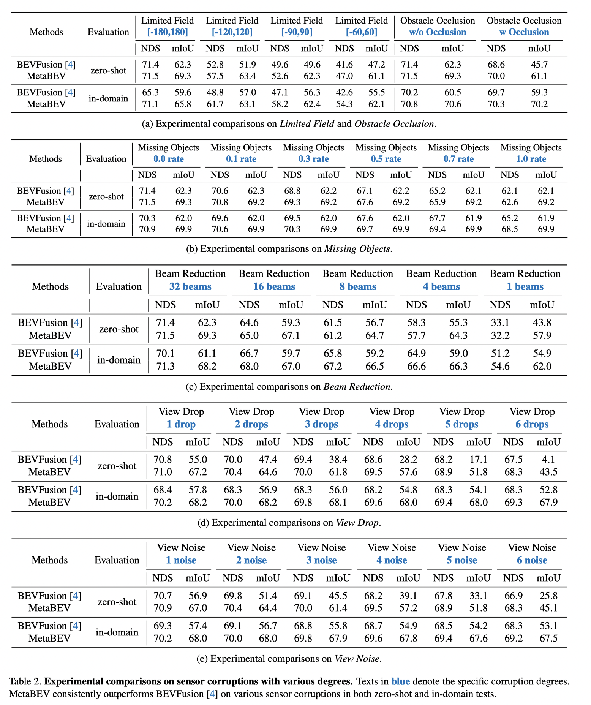

<div align="center">

### **[MetaBEV: Solving Sensor Failures for BEV Detection and Map Segmentation](https://arxiv.org/abs/2304.09801)**

[Chongjian GE*](https://chongjiange.github.io/),
[Junsong Chen*](https://scholar.google.com/citations?user=p4zxPP8AAAAJ&hl=zh-CN),
[Enze Xie+](https://xieenze.github.io/),
[Zhongdao Wang](https://zhongdao.github.io/),
[Lanqing Hong](https://scholar.google.com/citations?user=2p7x6OUAAAAJ&hl=zh-CN),
[Huchuan Lu](https://scholar.google.com/citations?user=D3nE0agAAAAJ&hl=en),
[Zhenguo Li](https://scholar.google.com/citations?user=XboZC1AAAAAJ&hl=en),
[Ping Luo+](http://luoping.me/)
<br>
（* denotes equal contribution, + denotes corresponding authors）

#### [Project Page](https://chongjiange.github.io/metabev.html) |  [arXiv](https://arxiv.org/abs/2304.09801) | [youtube demo](https://www.youtube.com/watch?v=TiEQpYq77Xo&list=PLB9_L58NpyEWcJhnX-a09CRXp-2kNEojY&index=2)

[](https://www.youtube.com/watch?v=TiEQpYq77Xo&list=PLB9_L58NpyEWcJhnX-a09CRXp-2kNEojY&index=1 "MetaBEV Demo")
</div>


## Updates
- (20/04/2023) MetaBEV is released on [arxiv](https://arxiv.org/abs/2304.09801). 

## Abstract
Perception systems in modern autonomous driving vehicles typically take inputs from complementary multi-modal sensors, e.g., LiDAR and cameras.
However, in real-world applications, sensor corruptions and failures lead to inferior performances, thus compromising autonomous safety.

In this paper, we propose a robust framework, called MetaBEV, to address extreme real-world environments, involving overall **six sensor corruptions** and **two extreme sensor-missing situations.**

Experiments show MetaBEV outperforms prior arts by a large margin on both full and corrupted modalities.
For instance, when the LiDAR signal is missing, MetaBEV improves **35.5%** detection NDS and **17.7%** segmentation mIoU upon the vanilla BEVFusion model;
and when the camera signal is absent, MetaBEV still achieves **69.2%** NDS and **53.7%** mIoU, which is even higher than previous works that perform on full-modalities.
Moreover, MetaBEV performs fairly against previous methods in both canonical perception and multi-task learning settings, refreshing state-of-the-art nuScenes BEV map segmentation with **70.4% mIoU**.

## Results
Our model achieves the following performance on :

#### 1-Single Complementary Modalities.
- Detection on nuScenes val set with LiDAR and Camera.

|Methods|Modality|Multi-Task|mAP(val)|NDS(val)|
|:----|:----|:----|:----|:----|
|MetaBEV-Transfusion|Camera|x|49.4|49.7|
|MetaBEV-Centerhead|Camera|x|55.5|60.4|
|MetaBEV-Transfusion|LiDAR|x|62.5|68.6|
|MetaBEV-Centerhead|LiDAR|x|64.2|69.3|
|MetaBEV-Transfusion|Camera+LiDAR|x|68|71.5|
|MetaBEV-Transfusion|Camera+LiDAR|√|65.4|69.8|

- Segmentation on nuScenes val set with LiDAR and Camera.

|Methods|Modality|Drivable|Ped.Cross|Walkway|Stop Line|Carpark|Divider|Mean|
|:----|:----|:----|:----|:----|:----|:----|:----|:----|
|MetaBEV|Camera|83.3|56.7|61.4|50.8|55.5|48|59.3|
|MetaBEV|LiDAR|87.9|63.4|71.6|55|55.1|55.7|64.8|
|MetaBEV|Camera+LiDAR|89.6|68.4|74.8|63.3|64.4|61.8|70.4|
|MetaBEV|Camera+LiDAR|88.5|64.9|71.8|56.7|61.1|58.2|66.9|

#### 2-Missing Modalities.

<table>
    <tr>
        <td rowspan="2">Methods</td>
        <td colspan="3">Camera+LiDAR</td>
        <td colspan="3">Missing Camera</td>
        <td colspan="3">Missing LiDAR</td>
    </tr>
    <tr>
        <td>mAP</td>
        <td>NDS</td>
        <td>mIoU </td>
        <td>mAP</td>
        <td>NDS</td>
        <td>mIoU</td>
        <td>mAP</td>
        <td>NDS</td>
        <td>mIoU</td>
    </tr>
    <tr>
        <td>MetaBEV</td>
        <td>68.0</td>
        <td>71.5</td>
        <td>70.4</td>
        <td>63.6</td>
        <td>69.2</td>
        <td>53.7</td>
        <td>39.0</td>
        <td>42.6</td>
        <td>54.4</td>
    </tr>
</table>

#### 3-Corrupted Modalities.



## Acknowledgements
The project is based on [mmdetection3d](https://github.com/open-mmlab/mmdetection3d), [BEVFusion](https://github.com/mit-han-lab/bevfusion), [robust benchmark](https://github.com/kcyu2014/lidar-camera-robust-benchmark). Thanks for their awesome works.

### License

This project is under the MIT license. See [LICENSE](LICENSE) for details.

## Citation
If you find MetaBEV useful or relevant in your research please consider citing our paper:
```
@article{ge2023metabev,
  title={MetaBEV: Solving Sensor Failures for BEV Detection and Map Segmentation},
  author={Ge, Chongjian and Chen, Junsong and Xie, Enze and Wang, Zhongdao and Hong, Lanqing and Lu, Huchuan and Li, Zhenguo and Luo, Ping},
  journal={arXiv preprint arXiv:2304.09801},
  year={2023}
}
```


